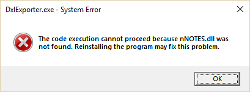

# 設定

Teamstudio Export を使用する前に、設定ウィザードを起動する必要があります。設定自体はファイルメニューから設定を選択することによって、いつでも設定し直すことができます。

## 環境設定
### アーカイブフォルダ
このフォルダは Teamstudio Export がアーカイブファイルの参照や新規作成を行う際に利用されます。アーカイブファイルはサーバーを反映するサブフォルダ構造を元に作成されます。また Teamstudio Export はネットワークドライブにて一つのアーカイブフォルダを共有しているので、複数のワークステーションを持つことができます。

!!! note
    アーカイブフォルダは必須です。Teamstudio Export はアーカイブフォルダ無しに作動することはできません。
    
### HTMLアウトプットフォルダ
このフォルダは Teamstudio Export でアーカイブのHTML版を作成するフォルダを指定します。アーカイブフォルダと同様に、Teamstudio Export はこのフォルダ内のサブフォルダ構造を管理しています。このフォルダの設定はアーカイブを HTML 形式でエクスポートしない限り必須ではありません。

### PDF アウトプットフォルダ
このフォルダーは Teamstudio Export でアーカイブの PDF 版を作成するフォルダを指定します。アーカイブや HTML フォルダと同様に、Teamstudio Export はこのフォルダ内のサブフォルダ構造を管理しています。このフォルダの設定はアーカイブを PDF 形式でエクスポートしない限り必須ではありません。

### ノーツフォルダ
アーカイブを作成する際、どのフォルダに Notes がインストールされているか特定する必要があります。Teamstudio Export はこの設定を自動で行いますが、もし複数バージョンの Notes がインストールされている場合は変更を加えなければなりません。Teamstudio Export はアーカイブを作成するために DxIExporter という補助プログラムを使用しています。エクスポートは DxIExporter が呼び出される前に、ここで指定したフォルダをファイルパスに追加します。また以下のエラーが発生した場合は、フォルダ設定が適切に指定されていないことを示します。 

<figure markdown="1">

</figure>

### Notes.ini の場所
アーカイブを生成するために使われる Notes.ini ファイルの場所を指します。基本的には適切に設定されてはいますが、必要であれば自分で修正することも可能です。

!!! note
    ファイル名含めた notes.ini ファイルへのパスを特定する必要があります。Notes.ini のファイルを含むフォルダ名だけでは不十分です。

### NotesID ファイル
アーカイブ生成するための Notes ID ファイルの場所です。この ID はアーカイブにしたいデータベースへのアクセス権限を持つ必要があります。

### パスワード
上記に記述した NotesID のパスワードです。このパスワードは暗号化された形式で保存されますが、アーカイブ生成時に平文の状態で DxlExporter に送信されます。パスポートを保存したくない場合は入力フィールドを空白にし、エクスポートが起動する間、ノーツクライアントが実行されているようにしてください。エクスポートにノーツにあるログイン情報を共有するためには、ノーツクライアントのメニューからファイル/セキュリティ/ユーザーセキュリティを選択し、他の Notes ベースのプログラムからのパスワード要求をしないをチェックしてください (セキュリティレベルは低下します)

### フルアクセスアドミニストレーションのリクエスト
このチェックボックスがオンになった場合、Teamstudio Export はデータベースをエクスポートする時のフルアクセスアドミニストレーションモードを可能にする試みを実行します。これにより、そのデータベースがACLのリストにない場合や読者フィールドにより通常時はアクセスできない場合でもエクスポートができるにようになります。この設定はユーザー自身がドミノサーバーの文書にあるセキュリティタブのフルアクセス管理者リストに存在する場合のみ有効です。またこの設定をノーツのセキュリティ基準を無視するために使うことはできません。

!!! note
    ユーザーによるフルアクセスアドミニストレーションのリクエストが認められていない状態では、Teamstudio Exportによるエラー表示はありません。これらの情報はNotes APIを通してもエラーの表示できません。しかし、Teamstudio ExportはACLや読者の問題によるデータベースの一部で起きたエクスポートの失敗については、エラーを表示します。

### ドミノサーバー
Teamstudio Exportがアーカイブするデータベースを検索するために使用するサーバーのリストです

* 新しいサーバーを追加する場合、サーバー名を入力し追加ボタンを押してください。サーバー名は正式名、略語、一般名などいかなる形式でも入力可能です。アーカイブは常に正式なサーバー名を保持しています。
* サーバーをリストから削除する場合、そのサーバーを選択し、削除ボタンを押してください。

利用可能なサーバーをリストから選択する場合は、サーバー名のフィールドの最後にある下矢印をクリックし、ドロップダウンリストからスキャンを選択してください。これにより、ローカルクライアントとホームメールアドレスにあるアドレス帳から既知のサーバーの情報がドロップダウンリストへ出力されます。利用可能なサーバーをスキャンする機能は今まで行われていたすべての Notes の設定が正しいと仮定して実行するため、例えば Notes プログラムフォルダの設定が適切でない、など設定に不備があるとエラーが発生することがあります。 

### ローカルデータベース
Export 3.2 以降ではローカルデータベースのアーカイブをサポートします (ローカルワークステーションの Notes ”data" フォルダーに配置されているデータベースが対象)。この機能は Export の環境設定で有効化できます。有効化にするとローカルデータベースはサーバーベースのデータベース群とともに Export の UI に表示され、同様にアーカイブすることができます。

## 詳細の追加設定
このページの設定で Export 内の詳細プロパティやベータ機能の有効化などの設定を行うことができます。

### 一時ファイルフォルダー
これは Teamstudio Export がデータベースのアーカイブ中に一時ファイルを作成するフォルダーになります。ファイルのサイズが非常に大きくなり、通常ではデータベースがアーカイブされるサイズの2〜3倍の大きさになる可能性があります。Export ではデフォルトでシステムの一時フォルダーを使用するようになっており、ほとんどのユーザーでは C: ドライブ上となります。異なるロケーションを指定したい場合には、*Use system folder for temporary files* のチェックを外し、ご希望のフォルダーを選択してください。

### 拡張ロギングの有効化
この設定でアーカイブ中に *log.txt* へ追加の詳細情報を書き込むことができます。お客様がアーカイブ生成時に問題に遭遇した場合、問題判別のため弊社の技術サポートがこのオプションを有効化することをお願いする場合があります。

### アーカイブ/HTML 削除の有効化
アーカイブと HTML/PDF 出力のすべてを Teamstudio Export 内で管理(ファイルシステムからの削除操作ではなく)したい場合もあります。このボックスにチェックを入れることで、メニューオプションが有効になり、Export 内からアーカイブとエクスポートされたコンテンツを削除することが可能になります。HTML や PDF 出力の削除しても、アーカイブファイルからすぐに再作成できるので比較的安全です。元の Domino サーバーが使用できなくなった場合、アーカイブの削除は不可逆的になる可能性があります。Export はファイルを削除する前に確認を求めますが、誤って削除する可能性を最小限に抑えるために、デフォルトでこのオプションを無効にしています。

### PDF のページサイズ
アーカイブを PDF へ出力する際 US Letter サイズから A4 サイズの間でページサイズを指定することができます。それ以外の異なるページサイズで出力する必要がある場合には技術サポートまでお問い合わせください。

### PDF のデフォルトフォント
このオプションでは、フォーム設計やリッチテキストの内容で特定のフォントが指定されていない場合に、文書をPDFに書き出す際に使用するフォントを指定することができます。このフォントは、フォーム設計で指定したフォントでは表現できない文字にも使用できます。デフォルトフォントは Arial ですが、これは最も多様なマシンで利用可能であり、英語や西ヨーロッパ言語に適しているためです。アプ リ ケーショ ンで日本語やその他の文字が必要な場合は、このフォントを自分やユーザーが使用している Unicode フォントに変更する必要があります。利用可能であれば、Arial Unicode MS が問題なく動作することが知られています。

!!! note
    Notes は他の Windows プログラムと同様に、画面にコンテンツを表示する際にフォントを代用することがよくあります。そのため、例えば、日本語の文字を含むリッチなテキストに Calibri フォントを指定している場合、日本語の文字そのものが Calibri では利用できなくても、Notesはそれを正しく表示します。一方、PDFの方がこの点においてはるかに厳密であり、指定したフォントでしか文字を表示しません。そのため、表示できない文字は Export ではデフォルトのフォントを代用して表示するようにしています。Notes 上では正しく表示されているのに、PDFに書き出した後に空の四角で表示されてしまう文字がある場合は、デフォルトのフォント設定で、表示されない文字が設定されているフォントに変更する必要があります。
    
### PDF 上の添付ファイル
デフォルトでは、文書内の添付は PDF 出力フォルダ内のファイルとし て作成され、 添付が存在する文書内ではそのファイルへの相対リンクを使用しています。この設定は、完全なアーカイブフォルダがファイルサーバーや WebサーバーからWebブラウザ経由でアクセスできるようになっている場合に最適で、ほとんどのブラウザ PDF ビューアでサポートされています。  あるいは、この設定を［埋め込み］に設定している場合、Export は PDF 内に添付ファイルを挿入するので、PDF を個別に配布する場合に便利です。しかし、現時点では、ほとんどのブラウザでは埋め込みファイルを表示することはできませんので、Acrobat Reader または FireFox を使用する必要があることに注意してください。

### 全文検索言語
Export の環境設定には日本語コンテンツの検索を最適化するオプションが用意されていますおり、日本語の表意文字用に調整されたトークナイザーを使用して検索インデックスを作成します。このオプションを有効化することで日本語コンテンツの検索の正確性が改善されます。
