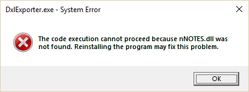

# Configuration

You must run the Configuration wizard before you can use Teamstudio Export. You can rerun it at any time by choosing *Configuration* from the *File* menu.

## Configuration Settings
### Archive Folder
This is the folder where Teamstudio Export will look for archive files and create new archive files. Archive files will be created within the folder using a subfolder structure that mirrors your servers. You can have multiple workstations running Teamstudio Export all sharing a single archive folder on a network drive.

!!! note
    The Archive Folder is required. Teamstudio Export cannot run without an Archive Folder.
    
### HTML Output Folder
This is the folder where Teamstudio Export will generate the HTML version of any archives that you choose to export. As with the Archive Folder, Teamstudio Export will manage the subfolder structure within this folder. This setting is not required if you will not be exporting archives to HTML.

### PDF Output Folder
This is the folder where Teamstudio Export will generate the PDF version of any archives that you choose to export. As with the Archive and HTML Folders, Teamstudio Export will manage the subfolder structure within this folder. This setting is not required if you will not be exporting archives to PDF.

### Notes Folder
If you will be generating archives then you must specify the folder where Notes is installed. Teamstudio Export will attempt to set this correctly but you may need to change it if you have multiple versions of Notes installed. Teamstudio Export uses a helper program, DxlExporter, to generate archive files. Export will add the folder specified here to the path before invoking DxlExporter. If you see an error like

<figure markdown="1">

</figure>

then this folder is not set correctly.

### Notes INI Location
The location of the notes.ini file to use when generating archives. This will usually be set correctly for you, but you can modify it if necessary.

!!! note
    You need to specify the full path to the notes.ini file here, including the file name. Do not just
    provide the folder containing the ini file.

### Notes ID File
The location of the Notes ID file to use when generating archives. This ID must have access to the databases that you will be archiving.

### Password
The password for the Notes ID file above. The password is stored in an encrypted form, but it is passed to the DxlExporter program in plain text when you create an archive. If you do not want to store a password, you can leave this blank and instead ensure that your Notes client is running whenever you run Export. To allow Notes to share credentials with Export, you must choose *File|Security|User Security...* from the menu in the Notes client, and check the box labeled *Don't prompt for a password from other Notes-based programs (reduces security)*.

### Request Full Access Admin
If this box is checked, Teamstudio Export will attempt to enable Full Admin Administration mode when exporting a database. This will allow you to export databases even when you are not listed in the ACL for that database and will also export documents that you would not normally be able to access owing to readers fields. This setting will only work if you are listed in the Full Access Administrators list on the Security tab in the server document for the Domino server; you cannot use this setting to override standard Notes security.

!!! note
    Teamstudio Export will not return an error if your request for Full Access Admin mode is not
    granted. This information is not returned to us by the Notes API. However Teamstudio Export **will**
    return an error if it is unable to export any part of a database because of ACL or readers issues.

### Domino Servers
The list of servers that Teamstudio Export will search for databases to archive.
* To add a new server to the list, enter the server name, and press the Add button. You can enter the server name in any form that is convenient for you: canonical, abbreviated, or just the common name. Archives will always contain the full canonical server name.
* To remove a server from the list, select the server and press the Remove button.

To pick from a list of available servers, click the down arrow at the end of the server name field and select <Scan> from the dropdown. This will populate the dropdown with a list of known servers from the address books on your local client and home mail server. Note that the ability to scan for available servers relies on earlier Notes settings being correct so you may see an error if, for example, the Notes program folder is not set correctly.

### Local Databases
Export 3.2 and later supports archiving local databases (those located in the Notes "data" folder on the local workstation). This feature can be enabled in the Export configuration settings.  When enabled, local databases are listed in the Export UI along with server-based databases, and can be archived in the same manner.

## Advanced Settings
The settings on this page allow you to configure advanced properties in Export and enable beta features.

### Temporary Files Folder
This is the folder where Teamstudio Export will create temporary files while archiving a database. These files may be large, typically two to three times the size of the database being archived. Export uses the system temporary folder by default which is on the C: drive for most users. If you need to use a different location, uncheck Use system folder for temporary files and select the desired folder.

### Enable Enhanced Logging
This setting writes more detailed information to the log.txt file during archiving. Our Technical Support team may ask you to enable this option if you are having problems generating an archive.

### Enable Archive/HTML Deletion
Some users prefer to manage everything to do with archives and HTML/PDF output from within Teamstudio Export. Checking this box enables menu options to allow users to delete archives and exported content from within Export. Deleting HTML and PDF output is relatively benign as it can always be recreated from the archive file. Deleting archives may be irreversible if the original Domino server is no longer available. While Export will prompt for confirmation before deleting files, we also disable this option by default to minimize the likelihood of accidental deletion.

### PDF Page Size
If you are exporting archives to PDF, this allows you to choose between US Letter, A4 and A3 page sizes in Portrait and Landscape orientation. Please contact Teamstudio Technical Support if you need a different page size.

### PDF Default Font
This option allows you to specify the font to use when exporting documents to PDF if no specific font is specified in the form design or rich text content. This font will also be used for any characters that cannot be represented using the font specified in the form design. The default is *Arial* since it is available on the widest variety of machines and it is a good choice for English and Western European languages. If your applications require Japanese or other characters then you should change this font to a unicode font that is available to you and your users. If it is available to you, *Arial Unicode MS* is known to work well.

!!! note
    Notes, in common with other Windows programs, often substitutes fonts when displaying content on the screen. So if, for example, you have a some rich text containing Japanese characters and specifying the *Calibri* font, Notes will display it correctly even though Japanese characters are not available in Calibri. PDFs are much stricter and will only display characters using the specified font. That is why Export will substitute the default font for characters that cannot be displayed. If you have characters that display correctly in Notes but display as empty squares after exporting to PDF then you need to change the default font setting to a font that contains the missing characters.
    
### PDF Attachments
By default, attachments in documents are created as files within the PDF output folder, and *relative links* are used in documents where the attachments reside. This configuration works best when the full archive folder is made available via web browser from a file server or web server, and is supported by most browsers' PDF viewers.  Alternatively, if this setting is set to *Embedded*, Export will insert the attached files within the PDF, which is helpful when distributing PDFs individually. At this time, however, most browsers cannot view embedded files and you will need to use Acrobat Reader or FireFox.

### Full-Text Search Language
The Export configuration includes an option to optimize searches for Japanese content by creating the search index using a tokenizer tuned for Japanese ideograms. Enabling this option improves search accuracy for Japanese content.
