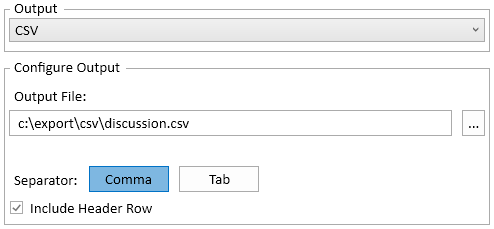

# 概要

Teamstudio Export は、アーカイブからさまざまな方法で Lotus Notes のデータをエクスポートできます。エクスポートする文書や含めるデータを完全に制御でき、複数の出力形式から選択できます。 

!!! 注意
    この機能は Export 5.0 で新しく追加されました。ただし、データのエクスポートに必要な情報は既存のアーカイブファイルにすでに含まれています。この機能を使用するのに、以前のバージョンでアーカイブされたデータベースを再度アーカイブする必要はありません。

## データのエクスポート
データのエクスポートプロセスを開始するには、メインウィンドウでデータベースを右クリックし、メニューから「Export Data...」を選択します。データベースはアーカイブされている必要がありますが、HTML や PDF へのエクスポートは不要です。

これにより、メインの *Export Data* ダイアログが表示されます。

<figure markdown="1">
  
</figure>

データをエクスポートするには、次の3つのステップがあります:

* 出力形式を選択して設定する
* エクスポートする文書を選択する
* エクスポートするデータを選択する

これらのステップは以下で詳細に説明します。

## 出力形式の選択
Export は、3つの異なる出力形式をサポートしています。

### CSV
このエクスポーターは、区切りテキストファイルを作成します。ファイルは UTF-8 でエンコードされます。

<figure markdown="1">
  
</figure>

* **Output File** 出力が書き込まれるファイルです。ファイルが既に存在する場合は上書きされます。
* **Separator** フィールドの区切り文字として、カンマまたはタブを使用できます。
* **Include Header Row** ファイルの最初の行に列名を含むヘッダーを追加します。

### SharePoint リスト
このエクスポーターは、新規または既存の SharePoint リストにアイテムを追加します。アイテムには元の文書の添付ファイルを含めることができますが、HTML または PDF プレビューは含まれません。

<figure markdown="1">
  
</figure>

* **Site** 以前に設定したサイトを選択します。*Sites...*ボタンを使用して、新しいサイトを追加するか、既存のサイトの設定を変更します。詳細は [Configuring SharePoint Sites](spsites.md) を参照してください。
* **List Name** ターゲットリストの名前です。リストが存在しない場合は新たに作成されます。
* **If List Exists** リストが既に存在する場合に行う操作を選択します。リストに新しいアイテムを追加するか、既存のリストを削除して新しいリストを作成します。
* **Include Attachments** リストアイテムに元の文書の添付ファイルや OLE オブジェクトを含めます。これにより、リストビューに標準の*Attachments*列も追加されます。

### 添付ファイル
このエクスポーターは、選択した各文書ごとにフォルダーを作成し、その中に添付ファイルを格納します。フォルダーは文書の Note ID を使用して命名されます。

<figure markdown="1">
  
</figure>

* **Output Folder** 添付ファイルがエクスポートされるルートフォルダーです。
* **Include Attachments** ドキュメントに含まれる通常の添付ファイルを含めます。
* **Include OLE Objects** OLE オブジェクトを含め、通常の文書に変換します。すべてのオブジェクトタイプがサポートされているわけではありませんが、ほとんどの Microsoft Word、Excel、PowerPoint オブジェクトは正しくエクスポートされます。
* **Include Embedded Images** リッチテキストフィールドに直接保存された画像を含めます。画像は *<fieldname\>\_embedded\_<counter\>.png* という名前で保存され、*fieldname* は画像を含むフィールドの名前、*counter* は 0 から始まり、見つかった画像ごとに増加します。

## エクスポートする文書の選択
エクスポートするドキュメントは、3つの方法で選択できます。

### 式による選択
Notes のビュー選択式に似た式を入力できます。ほとんどの @関数がサポートされています。選択式と同様に、式が 0 以外の数値を返す場合、文書が含まれます。式が 0 または数値以外の値を返す場合、文書は含まれません。

<figure markdown="1">
  
</figure>

### ビューによる選択
既存のビューまたはフォルダーを選択すると、すべての一致する文書がエクスポートされます。エクスポートしたいデータに一致するビューまたはフォルダーが存在する場合、式を使用するよりもこのオプションを使用する方が大幅に高速です。Export はアーカイブされたビューからデータを直接読み取ることができ、アーカイブ内のすべての文書をロードして選択式に一致させる必要がないため、はるかに高速です。ただし、このオプションではビューの列のみをエクスポートでき、追加のフィールドや計算値を追加することはできません。

ビューを選択すると、ビュー内のすべての列と Note ID がエクスポートされる列のリストに追加されます。

<figure markdown="1">
  
</figure>

### 検索による選択
全文検索式に一致するすべての文書をエクスポートできます。検索には強力な Lucene.NET ライブラリを使用しており、これまで HTML/PDF にエクスポートされたデータベースで提供される検索機能よりも多くのオプションを提供します。特に、検索は用語を含む文書を必ず返す *"quoted expressions"*, *+term* と特定の用語に一致する文書を除外する *-term* をサポートしています。テキスト、テキストリスト、リッチテキストフィールド内のすべてのコンテンツがインデックス化されます。

このオプションを初めて選択すると、*Create Search Index* という大きなボタンが表示されます。

<figure markdown="1">
  
</figure>

これをクリックすると、データベースをインデックス化するバックグラウンドタスクが開始されます。中程度サイズのデータベースでは、このプロセスは数秒で完了しますが、サイズが大きいデータベースでは時間がかかる場合があります。この場合、データエクスポートのダイアログを閉じて、インデックスの構築中に Export を続行できます。インデックス化の進行状況は [Progress Window](progress.md) で追跡できます。インデックスは通常、ホームフォルダー内の AppData\Local\Teamstudio に保存されます。

インデックスが作成されると、検索式を入力できる検索フィールドが自動的に表示されます。

<figure markdown="1">
  
</figure>

## 列の選択
最後のステップは、エクスポートする列の設定です。各列にはタイトル、コンテンツ、タイプがあり、これらの要素は出力形式に応じて異なる解釈がされる場合があります。

* **Title** タイトルは CSV のヘッダー行や SharePoint の列名として使用されます。リストの値をクリックすることで編集できます。
* **Content** 列の内容を説明します。直接編集することはできません。
* **Type** 列のデータタイプです。これは SharePoint のみに関連し、SharePoint のリスト列にはデータタイプが必要です。CSV では、すべての列がテキストとして扱われるため、Export は元の Notes データベースで指定された数値/日付時刻のフォーマットオプションを使用して列をフォーマットできます。新しい列をフォームフィールドから追加すると、データタイプは自動的に Notes で指定されたものを採用しますが、リスト内でクリックし変更することもできます。Export は指定された列タイプへのデータ変換を試みますが、変換が不可能な場合は列は空白になります。

!!! 注意
    *Text* 列タイプは SharePoint の要件により 255 文字に制限されています。必要に応じて、Export はそれ以降の値を切り捨てます。長いテキスト値がある場合は、代わりに *Multiline Text* タイプを使用することをお勧めします。

添付ファイルをエクスポートする場合、列はまったく使用されません。

列を削除するには、列を選択して *Delete* キーを押すか、右クリックしてメニューから *Remove* を選択します。列を誤って削除した場合は、*Add...* ボタンを使用して再度追加できます。列の順序は、リスト内で上下にドラッグして変更できます。

### 標準列を追加する
標準列を追加するには、*Add...* ボタンをクリックします。これにより、追加可能なすべての列が表示されるダイアログが表示されます。文書をビューを使用して選択している場合、このボタンは手動で列を削除しない限り無効になります。列を削除した場合は、*Add...* ボタンを使用して再追加できます。

文書を式や検索で選択している場合、このダイアログにはデータベース内のすべてのフォームが表示されます。フォームをクリックすると、フォーム内のすべてのフィールドが表示されます。1つ以上のフィールドを選択して、出力に追加します。

<figure markdown="1">
  
</figure>

!!! 注意
    フィールドを追加すると、元のフォームからデータタイプと表示オプションも取得されます。たとえば、日付時刻フィールドが日付のみを表示するように設定されている場合、Export はフィールドをテキストに変換する際にこの設定を使用します。
    
!!! 注意
    フィールドのリストは非常に長くなることがあります。メインの Export ウィンドウと同様に、*Ctrl-F* を押して検索バーを表示し、探しているフィールドの名前を入力し始めることで、一致するフィールドのみが表示されるようにダイアログがフィルタリングされます。フィールドを表示するには、表示されたフォームを展開する必要がある場合があります。

### 計算列を追加する
計算列を追加するには、*Computed...* ボタンをクリックします。これにより、列のタイトルと式を入力できるダイアログが表示されます。ビューで文書を選択している場合、このボタンは無効になります。ビューエクスポートでは、ビュー内のデータにしかアクセスできず、文書全体にはアクセスできないためです。

ここでは、Export がサポートする任意の @関数を使用できます。リッチテキストフィールドにあるテキストを出力に含めたい場合は、@Abstract が便利です。式が数値や日付時刻の値を生成する場合、出力形式を指定することはできませんが、@Text を使用して値のフォーマット方法を制御できます。

<figure markdown="1">
  
</figure>

計算列の式を確認するには、*Content* 列に表示されている *<Computed/>* テキストの上にマウスをホバーします。また、列をダブルクリックしてダイアログを再度開き、式を編集することもできます。

### リンク列を追加する
リンク列は、HTML または PDF で出力された文書に対応するそれぞれの文書への URL リンクを生成します。この時点では Export は、データベースが HTML または PDF に出力済みかどうかを特に事前に確認しないので、最初にデータをエクスポートしてから後でデータベースを HTML/PDF に出力することができます。

<figure markdown="1">
  
</figure>

* **Link Type** HTML リンクと PDF リンクのフォーマットは若干異なるため、Export は生成するリンクタイプを知る必要があります。
* **Link Location** Export の Configuration で指定された標準の HTML または PDF 出力先を選択するには、*Default* を選択します。エクスポートされたサイトを新しい場所にアップロードしたい場合は、*Custom* を選択します。
* **Path To Index Page** 上記で *Custom* を選択した場合は、サイトの index ページの完全な URL を入力します。特に、サイトを SharePoint にアップロードした場合は、その URL の最後が *index.html* ではなく *indexsp.aspx* になるようにしてください。

リンク列は、SharePoint には URL 列としてエクスポートされ、プレーンテキストではエクスポートされません。

## プレビュー
ダイアログの左下にある *Preview...* ボタンをクリックすると、データベースから最大 50 件の一致する文書が表示されます。これにより、文書の選択や列の定義が正しく設定されているかを確認できます。大規模なデータベースを検索している場合や、選択式に一致する文書が少ない場合、プレビューが一致する文書を見つけるのに時間がかかることがあります。プレビューは、文書が見つかるたびに更新されます。完了を待たずに、いつでも閉じることができます。

## エクスポート
エクスポートを設定し、出力をプレビューした後、*OK* をクリックするとエクスポートが開始されます。エクスポートはバックグラウンドで実行され、他のバックグラウンドタスクと同様に [Progress Window](progress.md) で監視できます。