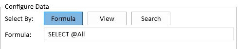

# Overview

Teamstudio Export can export Lotus Notes data from an archive in a variety of different ways. You have complete control over which documents are exported and what data is included, and can choose from a variety of different output formats. 

!!! note
    This feature is new in Export 5.0. However, all of the information needed to export data is already contained in any existing archive files. You do not need to
    re-archive databases archived with an earlier version of Export to use this feature.

## Exporting Data
To start the process of exporting data, right-click on a database in the main window and choose 'Export Data...' from the menu. The database must be archived, but does not need to have been exported to HTML or PDF.

This will display the main *Export Data* dialog.

<figure markdown="1">
  
</figure>

There are three steps to exporting data:

* Choose and configure an output format
* Choose which documents to export
* Choose the data you want to export

These steps are described in detail below.

## Choosing an Output Format
Export supports three different output formats.

### CSV
This exporter will create a delimited text file. The file will be UTF-8 encoded.

<figure markdown="1">
  
</figure>

* **Output File** The file where the output will be written. The file will be overwritten if it already exists.
* **Separator** Files can be written using either a comma or a tab as the field separator.
* **Include Header Row** Include a header containing the column names as the first row of the file.

### SharePoint List
This exporter will add items to a new or existing SharePoint list. The items may include attachments from the original document, but will not include an HTML or PDF preview of the document.

<figure markdown="1">
  
</figure>

* **Site** Select a site that you have previously set up. Use the *Sites...* button to add a new site or modify the settings for an existing site. See [Configuring SharePoint Sites](spsites.md) for details.
* **List Name** The name of the target list. It will be created if it does not already exist.
* **If List Exists** What Export should do if the list already exists. You can either add new items to the
list or delete the existing list and create a new one.
* **Include Attachments** Include attachments and OLE objects from the original document in the list item. This will also add the standard *Attachments* column to the list view.

### Attachments
This exporter will create a folder for each selected document that contains attachments. The folder will be named using the document's Note ID. 

<figure markdown="1">
  
</figure>

* **Output Folder** The root folder where the attachments will be exported.
* **Include Attachments** Include regular attachments from the document.
* **Include OLE Objects** Include OLE objects, converted to regular documents. Not all object types are supported, but most Microsoft Word, Excel and PowerPoint
objects should export correctly.
* **Include Embedded Images** Include images that have been stored directly in a rich text field. The image will be named *<fieldname\>\_embedded\_<counter\>.png*, where *fieldname* is the name of the field containing the image and *counter* starts at 0 and increases for each image found.

## Choosing Documents to Export
You can select the documents to export in three different ways.

### Select By Formula
This allows you to enter a formula, similar to a Notes view selection formula. Most @functions are supported. As with a selection formula, a document will be included if the formula returns a non-zero number. If the formula returns 0 or any value other than a number, the document will not be included.

<figure markdown="1">
  
</figure>

### Select By View
This allows you to select an existing view or folder, and all matching documents will be exported. If there is an existing view or folder that matches the data you want to export then it will be significantly faster to use this option rather than a selection formula. Export can read the data directly from the archived view, which is much quicker than having to load every document in the archive and match it against the selection formula. However this option only allows you to export columns from the view. You cannot add additional fields or computed values.

When you select a view, all of the columns from the view, along with the Note ID will be added to the list of columns to be exported.

<figure markdown="1">
  
</figure>

### Select by Search
This allows you to export all documents that match a full-text search expression. The search uses the powerful Lucene.NET library, and offers many more options than the search we can offer in exported HTML/PDF databases. In particular, search supports *"quoted expressions"*, *+term* to require that a term must be present and *-term* to exclude documents matching a particular term. All content in text, text list and rich text fields is indexed.

The first time you select this option, you will see a large button titled *Create Search Index*.

<figure markdown="1">
  
</figure>

Clicking this will start a background task to index the database. For moderate sized databases this process will only take a few seconds, but for large databases it may take a long time. In this case, you can close the Data Export dialog and continue working with Export while the index is being built. You can track the status of the indexing in the [Progress Window](progress.md). The resulting index will be stored in the local application folder which is usually AppData\Local\Teamstudio inside your home folder.

Once the index is built, the dialog will automatically update to show a search field where you can enter the search expression.

<figure markdown="1">
  
</figure>

## Selecting Columns
The final step is to configure the columns to be exported. Each column has a title, some content and a type. These elements may be interpreted differently based on the output format.

* **Title** The title will be used in the header row for CSV and as the column name for SharePoint. You can edit it by clicking on the value in the list.
* **Content** This describes the content of the column. It cannot be directly edited.
* **Type** The datatype of the column. This is only relevant for SharePoint, since list columns need to have a datatype in SharePoint. In CSV, all columns are treated as text, so that Export can format them using the number/datetime formatting options specified in the original Notes database. The datatype will be automatically set from Notes when you add a new column from a form field, but you can change it by clicking on it in the list. Export will attempt to convert data to the requested column type, but will leave the column blank if the conversion is not possible.

!!! note
    The *Text* column type is limited to 255 characters to meet SharePoint requirements. Export will truncate longer values if necessary. If you have longer text values, you may want to use the *Multiline Text* type instead.

The columns are not used at all when you are exporting attachments.

You can delete a column by selecting it and hitting the *Delete* key or by right-clicking on it and choosing *Remove* from the menu. If you delete a column by mistake, you can add it back using the *Add...* button. You can also reorder columns in the output by dragging them up and down in the list.

### Add A Standard Column
To add a standard column, click the *Add...* button. This will display a dialog showing all of the columns that can be added. If you are selecting documents using a view, this button will be disabled unless you have manually removed some columns. If you have removed columns then you can use the *Add...* button to add them back.

If you are selecting documents by formula or by search then this dialog will show a list of all of the forms in the database. You can click on a form to expand it and show all of the fields on that form. Select one or more fields to add them to the output.

<figure markdown="1">
  
</figure>

!!! note
    Adding a field will also pick up the datatype and display options from the original form. So if, for example, a datetime field is configured to display only the date, Export will use this setting when converting the field to text.
    
!!! note
    The list of fields can be very long. As with the main Export window, you can press *Ctrl-F* to display a search bar and start typing the name of the field you are looking for. This will filter the dialog to only show matching fields. You may need to expand the displayed forms to see the fields.

### Add A Computed Column
To add a computed column, click the *Computed...* button. This will display a dialog where you can enter a title for the column and a formula. This button will be disabled if you are selecting documents by view since view exports only have access to data in the view, not the entire document.

You can use any of the @functions that Export supports here. That includes @Abstract, which is useful if you have text in a rich text field that you want to include in the output. It is not possible to specify an output format if your formula generates numeric or datetime values, but you can use @Text to control the way the value is formatted.

<figure markdown="1">
  
</figure>

You can view the formula for a computed column by hovering the mouse over the *<Computed/>* text that is displayed in the *Content* column. You can also double click on the column to re-open the dialog and edit the formula.

### Add A Link Column
A link column will generate a URL link to the corresponding document in the format that Export uses for HTML or PDF exports. Export will not check to see if the database has already been exported to HTML or PDF so you can perform the data export first and then export the database to HTML/PDF later.

<figure markdown="1">
  
</figure>

* **Link Type** The format for HTML and PDF links is slightly different, so Export needs to know which type to generate.
* **Link Location** Choose *Default* for the standard HTML or PDF export location specified in your Export Configuration. Choose *Custom* if you have uploaded the exported site a new location.
* **Path To Index Page** If you chose *Custom* above, enter the full URL of the index page of your site. In particular, if you have uploaded your site to SharePoint, make sure that the URL ends with *indexsp.aspx* rather than *index.html*.

Link columns will be exported to SharePoint as URL columns rather than plain text.

## Preview
The *Preview...* button at the bottom left of the dialog will show up to 50 matching documents from the database. This allows you to check that you have the document selection and column definitions set up correctly before starting the export. It may take some time for the preview to find matching documents if you are searching a large database and not many documents match the selection formula. The dialog will update to show matching documents as they are found. You can close it at any time without waiting for the preview to complete.

## Export
Once you have configured the export and previewed the output, you can start the export by clicking *OK*. The export itself will take place in the background and, as with any background task, can be monitored in the [Progress Window](progress.md).