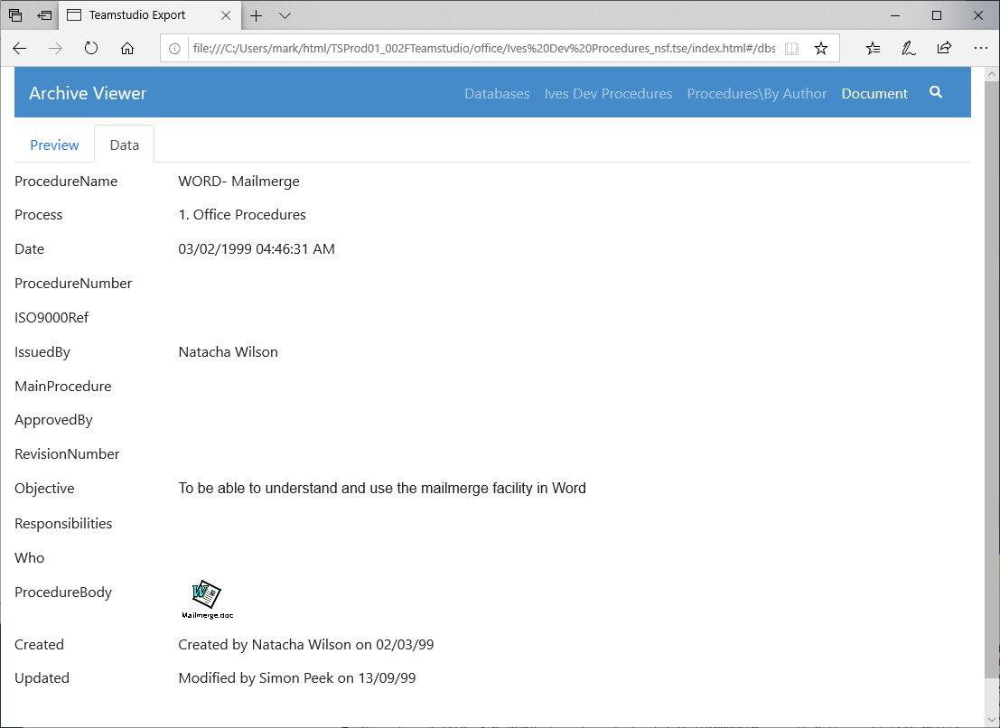

# HTMLへのエクスポート

Teamstudio Export はアーカイブから静的な HTML サイトを生成できます。このサイトには、カテゴリ分けを含むデータベース内のすべてのビューの表現と文書ビューが含まれます。文書ビューは、Notes クライアントで表示される文書ののプレビューと、文書に保存されているアイテムの値の簡単なテーブルを表示します。そのテーブルには、例えば、データベース内で文書を表示するフォームが存在しない場合やひとつしかないフォームでブラウザ表示する設計がある場合に便利です。

## HTML サイトの生成
アーカイブを HTML にエクスポートするには、メイン画面からエクスポートするデータベースを選択し、選択したデータベースの一つを右クリックし、コンテキストメニューから *Export to HTML* を選択します。標準的な Windows の操作と同様に、 *Ctrl キーを押しながらクリック* してデータベースの範囲を選択し、 *Alt キーを押しながら* 選択項目にデータベースを追加することもできます。追加する前に既存のアーカイブ操作が完了するのを待つ必要はありませんが、エクスポートは最大3つのタスクを一度に実行し、それ以外のタスクは既存のタスクが完了するまで待機状態になります。

[進行状況ウィンドウ](progress.md)から、進行中または待機状態にあるアーカイブのタスクの状況を確認することができます。エクスポート中に発生したエラーや警告を処理する方法については、上記のリンクページを参照してください。

HTML サイトは、設定で指定した *HTML Output Folder* 内に生成されます。

!!! note
    HTML サイトはそのまま動作が可能で、実行の際ランタイム等の必要はありません。またサイトフォルダをファイルシステム上の別の場所またはWebサーバーにコピーして、最新のブラウザで表示させることができます。サイトを作成するには Teamstudio Export のライセンスが必要ですが、生成されたサイトを配布および表示するだけなら継続的なライセンスも実行時の費用も必要ありません。
    

## Database-level Configuration
Export 4.5.0 adds the ability to tailor the values returned by @UserName, @UserRoles and @Environment for each database. To access the new configuration dialog, right-click on a database and select *Configure HTML...* from the context menu. The values entered into the dialog are saved into the *config* folder within the HTML output and will be re-used if you subsequently re-export the same database.

## HTML サイトの表示
アーカイブを HTML にエクスポートしたら、メイン画面からデータベースを右クリックし、コンテキストメニューから *View HTML* を選択してサイトを表示させることができます。このプロセスによりデフォルトブラウザでサイトのホームページが表示されます。

<figure markdown="1">
  
</figure>

データベースをクリックすると、データベース内のビューのリストと、各ビューの文書数が表示されます。

<figure markdown="1">
   
</figure>

ビューをクリックすると、ビューに相当する画面が表示されます。元々ある Notes ビューの外観と完全に一致はしませんが、ほとんどが元のフォーマットと一致し、すべてのデータを含みます。

<figure markdown="1">
  
</figure>

ビュー内の文書をクリックすると、その文書に相当する画面が表示されます。デフォルトでは文書のプリビューが選択され Notes クライアントで表示される内容と同等のものが表示されます。

<figure markdown="1">
  
</figure>

このプリビュー表示ではオリジナルのフォーム設計が無かったり Export がサポートしないプロパティに依存している場合には役に立たない可能性があります。このような場合には、スクリーン上部の Data タブを選択し文書内のアイテムすべての一覧表示形式で確認することもできます。

<figure markdown="1">
  
</figure>

## 文書リンク
データベース毎に文書リンクがサポートされています。対象となるデータベースが **アーカイブされている** 限り、データベース間の文書リンクもサポートされています。もちろん対象となるデータベースは、文書リンクが正しく機能するために HTML にエクスポートしておく必要はありますが、対象となるデータベースのアーカイブが存在する限り、文書リンクは作成されます。

!!! note
    文書リンクを含むデータベースのグループがある場合、それらのいずれかをHTMLにエクスポートする前に、全てのデータベースをアーカイブする必要があります。このプロセスにより、全ての文書リンクが適切にエクスポートされます。

## 埋め込みビュー
Export 4.3.0 より埋め込みビューも HTML へ出力できるようになりました。埋め込みビューを出力するための要件があります:

* The view must be in a database that has been archived.
* 埋め込みビューには *単一カテゴリの表示* のオプションがセットされていること。

埋め込みビューをエクスポートすると、エクスポート処理が少し遅くなります。現在の実装は、数十万エントリまでのビューに最適化されています。これよりはるかに大きなビューを使用していて、パフォーマンスの問題が発生した場合は、サポートに連絡してください。

Prior to Export 4.5.0, embedded views had to be in the current database. Export 4.5.0 added support for embedded views in other databases but, as with doclinks, the other database must have been archived so that the view data is available to Export.

## プリビュー表示の制限
Export の文書プリビュー表示は Notes フォームを表示するのに必要なほとんどのプロパティを理解し動作します。しかしながらサポートされない主な機能は以下のとおりです

* フォームで使用されていたりフィールドから起動される LotusScript、JavaScript、エージェント
* @DbColumn. As of Export 4.5.0, both @DbLookup and @GetDocField are now supported
* アクション
* レイアウト領域
* 埋め込みのコントロール群 (埋め込みビューはサポート*しています*)
* Passthru HTML

Export はリッチテキストを HTML へ変換し、@関数言語のサブセットを処理し文書プリビューを生成します。プリビューには計算結果の値や非表示式の計算も可能な限り遵守しています。Export の新リリースでは頻繁に @関数 のサポートとレンダリングに関する改善を行っています。Export はアプリケーションのアーカイブから HTML を再生成することでこれらの改善を組み入れることができるようになっています。オリジナルの Notes アプリケーションにアクセスする必要はありません。実装されていない @関数およびレンダリングに関する問題がありましたら調査のために [techsupport_japan@teamstudio.com](mailto:techsupport@teamstudio.com) までご連絡ください。

## 一般的な HTML に関する制限
Export はアーカイブしたアプリケーションを読み取り専用のデータの表示を簡単にできるようデザインされた HTML サイトを生成します。ビューと文書にのみフォーカスしており、ユーザーがこれまで慣れ親しんだやり方で文書を見つけアクセスできる方法を提供しつつ、Notes フォームに表示されるのと同等の内容を表示しています。しかしながら、 Export ではナビゲーター、アウトライン、フレームセット、ページ、エージェント、スクリプトライブラリーのような他の設計要素の代わりとなるいかなる HTML も生成しません。

## 全文検索
Export 2.0 から、HTML にエクスポートされたデータベースは全文検索が可能になりました。まず、検索したいビューを選択し、虫眼鏡をクリックすると検索ボックスが表示されます。Enter キーを押すと、検索が実行されます。ビューの中で、検索語の **全て** に一致する文書がすべて表示されます。文書は、文書内の一致件数と、一致した単語がデータベース内でどれだけ共通しているかによって決まる、一致の強さに基づいて並べ替えられます。例えば、データベース内に数回しか出現しない検索語にマッチした場合、*the*のような一般的な単語にマッチした場合よりも強いマッチングとなります。

全文索引には、テキストまたはリッチテキストフィールドで見つかった 2 文字以上のすべての単語が含まれます。検索は、単語の先頭にある検索語のみにマッチします。例えば、*at*を検索すると、*attach*にはマッチしますが、*cat*にはマッチしません。

Export 3.1 以降では、最小2文字の制限のもと、テキストだけでなくインデックス番号も出力できます。なお、インデックスの生成には、共通の単語境界が使用されます。345678のような注文番号のような連続した数字のセットの検索はサポートされていますが、03/04/1999の検索は、それらが一緒に配置されているか、日付値としてフォーマットされているかどうかにかかわらず、03、04、1999で始まる個々のトークンを持つすべての文書と一致します。

検索の索引には添付ファイル内のテキストは含まれていません。

!!! note
    Export 3.2 で Export の環境設定内に日本語のコンテンツに対する検索を調整するこのオプションを導入しました。日本語の表意文字用に調整したトークナイザーを使用して検索索引を作成します。この設定を有効にし、HTMLに再出力すると検索索引が更新されます。
  