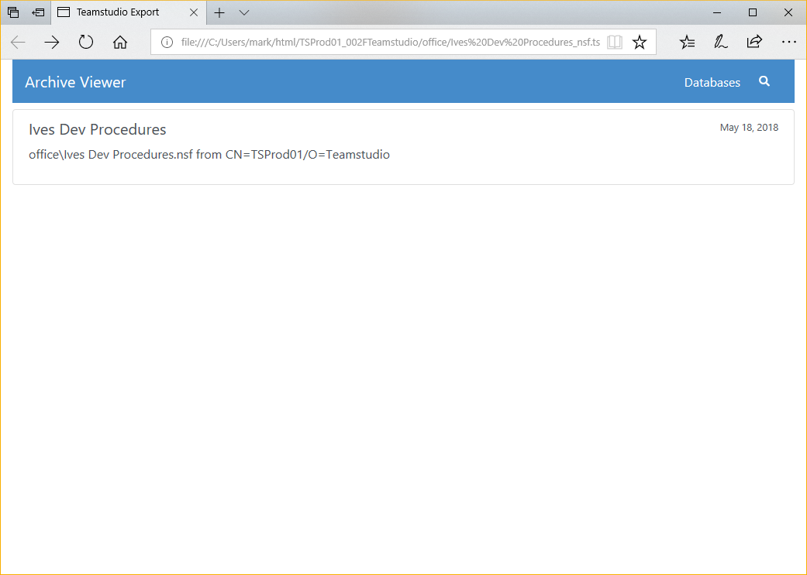

# Exporting to HTML

Teamstudio Export can generate a static HTML site from an archive. The site contains a representation of all of the views in the database, including categorization, along with a document viewer. The document viewer shows a preview of the document as it would appear in the Notes client, along with a simple table of items values stored in the document. The table is useful when, for example, there is no form in the database that can display the document or the only form was designed for viewing in a browser. 

## Generating an HTML Site
To export archives to HTML, select the database or databases to be exported from the main window, right-click on one of the selected databases, and select *Export to HTML* from the context menu. As with standard Windows controls, you can use *Ctrl-Click* to select a range of databases and *Alt-Click* to add a database to the selection. You do not need to wait for all existing export operations to complete before adding more, but note that Export will run at most 3 tasks at once, and all other tasks will be queued until earlier operations have completed.

You can view the status of any active and queued tasks from the [Progress Window](progress.md). Please see that page for details of how to handle errors and warnings encountered during exporting.

HTML sites will be generated inside the *HTML Output Folder* specified in the Configuration.

!!! note
    HTML sites are self-contained and have no runtime requirements. You can copy the site folder to another location on the file system or onto a web server and view it with any modern browser. While a Teamstudio Export license is required to generate the site, there are no ongoing licensing or runtime costs to distribute and view generated sites.
    

## Database-level Configuration
Export 4.5.0 adds the ability to tailor the values returned by @UserName, @UserRoles and @Environment for each database. To access the new configuration dialog, right-click on a database and select *Configure HTML...* from the context menu. The values entered into the dialog are saved into the *config* folder within the HTML output and will be re-used if you subsequently re-export the same database.

Export 4.5.1 adds additional database-level configuration options to modify display settings. If the *Use Defaults* box is checked, the global settings from the configuration wizard will be used. If you uncheck this box, you can configure the *Display Mode* and *Expand all sections* settings for this database only.

## Viewing an HTML Site
Once an archive has been exported to HTML, you can view the site by right-clicking on the database in the main window and selecting *View HTML* from the context menu. This will launch your default browser to the home page of the site.

<figure markdown="1">
  
</figure>

Clicking on the database will show a list of views in the database, along with a count of documents in each view.

<figure markdown="1">
   
</figure>

Clicking on a view will show a representation of the view. This does not attempt to fully match the look of the original Notes view, but does contain all of the data and matches most of the original format.

<figure markdown="1">
  
</figure>

Clicking on a document in the view will show a representation of the document. By default, a preview of the document is shown as it would have appeared in the Notes client.

<figure markdown="1">
  
</figure>

The preview may not be helpful if the original form is not available or relies on properties that Export does not support. In that case, you can select the Data tab at the top of the screen to see a simple tabular representation of all of the items in the document.

<figure markdown="1">
  
</figure>

## Doclinks
Doclinks within a single database are supported. Doclinks between databases are also supported as long as the target database has been **archived**. Of course, the target database will also have to be exported to HTML for the doclink to function correctly, but the doclink will still be created as long as an archive exists for the target database.

!!! note
    If you have a group of databases that contain doclinks between themselves, you should archive
    all of the databases before exporting any of them to HTML. This ensures that all doclinks will
    be exported correctly.

## Embedded Views
Starting with Export 4.3.0, Embedded Views are exported to HTML. There are a few requirements for the view to be exported:

* The view must be in a database that has been archived.
* The embedded view must have the *Show Single Category* option set.

Exporting embedded views will slow down the export process a little. The current implementation has been optimized for views up to a few hundred thousand entries. If you have significantly larger views and encounter performance problems, please contact support.

Prior to Export 4.5.0, embedded views had to be in the current database. Export 4.5.0 added support for embedded views in other databases but, as with doclinks, the other database must have been archived so that the view data is available to Export.

## Preview Limitations
The Export document previewer understands most of the properties that are necessary to display a Notes form. The main features that are not supported are

* LotusScript, JavaScript, or Agents used by the form or invoked to populate fields
* @DbColumn. As of Export 4.5.0, both @DbLookup and @GetDocField are now supported
* Actions
* Layout Regions
* Embedded Controls (Embedded Views *are* supported)
* Passthru HTML

Export converts Rich Text to HTML and processes a subset of @Formula language to generate document previews that include computed values and respect hide-when calculations, where possible. New releases of Export often enhance @Formula support and improve rendering. Export can regenerate the HTML from the application archive to incorporate improvements - without requiring access to the original Notes application. Missing @Formula functions, and other rendering issues, can be reported to [techsupport@teamstudio.com](mailto:techsupport@teamstudio.com) for evaluation.

## General HTML Limitations
Export generates an HTML site designed to make it easy to view the read-only data in archived applications. Views and Documents are the focus of this functionality, providing familiar ways to find and access documents, and view documents as they would appear in the Notes form. Export does not generate any HTML representation of other design elements such as navigators, outlines, framesets, pages, agents, or script libraries.

## Full-Text Search
Starting with Export 2.0, databases exported to HTML are full-text searchable. To start, select the view that you want to search and click the magnifying glass to show the search box. The search will be performed when you hit the Enter key. All documents in the view that match **all** of the search terms will be displayed. The documents are sorted based on the strength of the match, which is determined by how many matches are in the document, and how common the matched words are in the database. For example, matching a search term that only appears a few times in the database is a stronger match than matching a common word like *the*.

The full-text index contains all words of 2 or more characters found in text or rich text fields. Searches only match search terms found at the beginning of words. For example, searching for *at* would match *attach* but would not match *cat*.

Export 3.1 and later index numbers as well as text, subject to the 2 minimum character limit. Note that common word boundaries are used to generate the index. Searches for contiguous sets of numbers are supported, such as order numbers like 345678; however, searches for 03/04/1999 will match any document with individual tokens beginning with 03, 04, and 1999, regardless of whether they are located together or formatted as a date value.

The search index does not contain text within attachments.

!!! note
    Export 3.2 introduced an option in the Export configuration to optimize searches for
    Japanese content by creating the search index using a tokenizer tuned for Japanese ideograms.
    Once this setting is enabled, re-exporting to HTML will update the search index.
  