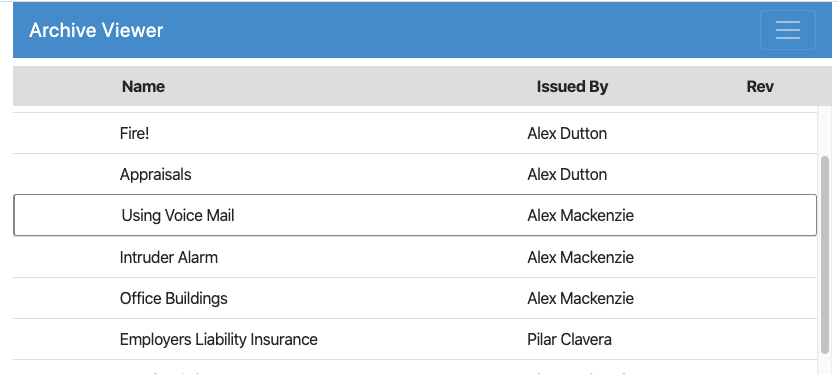

# Keyboard Navigation

Starting with Export 3.1, keyboard navigation is enabled by default for HTML exports. View position is also maintained when navigation between views and documents.

!!! note
    When keyboard navigation is enabled, a double-click is required to open a view or document. Single clicking
    will select, but not open, the selected item.
    
The available keyboard shortcuts are a small subset of the shortcuts used in the Notes client.

## View-Level Shortcuts
* *Arrow Up* Move the selection up one row; hold to repeat.
* *Arrow Down* Move the selection down one row; hold to repeat.
* *Enter* Open the selected document (ignored for categories.)
* *Escape* Go up one level, returning to the list of views.

## Document-Level Shortcuts
* *Enter* Open the next document in the current view (skipping categories); hold to repeat.
* *Escape* Go up one level, returning to the current view.

## Caret Position
The selected document in the view is marked with a black outline, representing the *caret position* in the view. Here, the third document is selected.

The caret position moves when the up/down arrows are pressed. The *Enter* key will open the selected document. When viewing a document, navigating to the next document by pressing the *Enter* key will also update the caret position so that the new document is selected when returning to the view.

## Searching
When views are searched in Export, the list of displayed documents is limited to those matching the search query. If the currently selected document is also found in the search results, it will continue to be selected in the search results (note that this may indicate that the search results have been scrolled down to include the selected document.)

Keyboard shortcuts work within the search results; when the search is cleared, the selected document will be restored in the unfiltered view.  The selected document will be the document selected in the search results, if applicable, or the document selected prior to the search if no selection change was made in the search results.

## Disabling Keyboard Shortcuts
To temporarily toggle keybaord shortcuts, press *Ctrl-Alt-Enter*. When keyboard shortcuts are disabled, the browser will respond normally to the keys and no caret document selection will show. A single-click will open documents in this mode.

When keyboard shortcuts are disabled, view position will still be restored when possible during navigation between views and documents. Searching results will not maintain selection position. When search results are cleared, the view will be reset to the last position where a document was opened, if applicable, or reset to the top if no document was opened from the view during the current session.

Keyboard shortcuts can be persistently disabled via the *config.js* file in the HTML export folder by adding the *useKeyboard* property to the *options* property at the root of the *config* object. For example

``` javascript
    'options': {'useKeyboard': false}
```
More information about *config.js* is available at [HTML View and Field Display](htmlviewfield.md).
