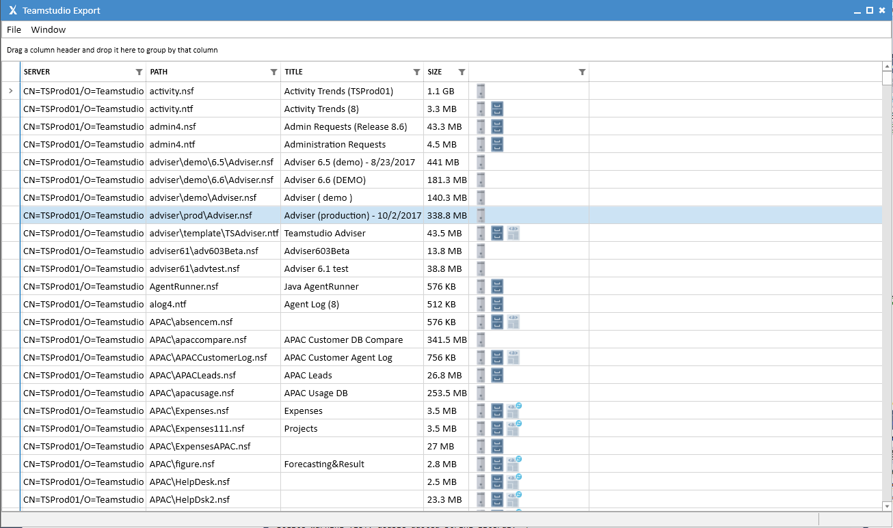
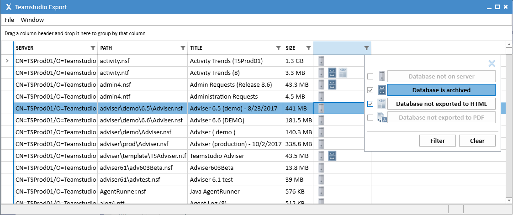

# Overview

Teamstudio Export is a tool that allows you to export all of your data and design information from your HCL Notes database to an open, XML storage format. Once your data is in XML, you can easily browse it or write converters to import it into other application environments. The archive format that Teamstudio Export uses is public and documented and has no associated licensing or runtime requirements. Teamstudio Export itself can also convert archives to nicely-formatted HTML web sites or collections of PDF documents that you can deploy to any file or web server with no runtime costs.

## Using Teamstudio Export
Once you have installed and configured Teamstudio Export, the main window will be populated with a list of all of the databases found on configured servers or already archived.

<figure markdown="1">

</figure>

## Refreshing the Main Window
Teamstudio Export caches the data displayed in the main window in a local database so that it does not have to rescan your servers, archive, and HTML folders every time it starts up. That means that data can become out-of-date if databases are added or removed from your servers or other workstations are creating archive files in a shared archive folder. You can refresh the contents of the main window at any time by choosing *Window|Refresh* from the main menu. This could take a little while if you are scanning large servers or archive directories and you will not be able to use Teamstudio Export until the operation completes.

## Database Status Icons

###  Server
This icon indicates that the database exists on the Domino server. It will not be present for databases that exist only as an archive.

###  Archive
This icon indicates that an archive file has been found for the database in the archive folder.

###  HTML
This icon indicates that the database has been exported to an HTML site in the HTML export folder. If there have been significant updates the the HTML output format since the database has been exported, the icon will be shown with an update symbol () to show that the database needs re-exporting.

###  PDF
This icon indicates that the database has been exported to a PDF site in the PDF export folder.

## Filtering on Database Status
You can filter the main UI on the database status to show, for example, all databases that have been archived but have not been exported to HTML. To access the filter dialog, click the Filter icon in the header at the top of the column with the status icons.

<figure markdown="1">
  
</figure>

The filter dialog shows the four status icons along with a checkbox and a toggle button. The checkbox is checked to show that you care about the value of that attribute. In the example above, we do not care whether the database is on a server, but we do care about the archive and HTML export status. For attributes that you care about, the toggle button is used to indicate whether the attribute should be present or not. In the example above, we require that the database must be archived but not HTML exported. Once you have configured the dialog appropriately, click the Filter button to apply your settings. You can clear an existing filter using the Clear button. Note that this does not reset the controls in the dialog to make it simple to re-apply the filter.

!!! note
    The filter is applied dynamically and so if a filter is in effect and an archive or HTML export
    operation completes, a database may be added or removed from the window. In the example above,
    if you export a database to HTML with the filter in effect, the database will disappear from
    the main window when the export completes.

## Filtering by Title or Path
You can quickly locate databases in the main window by searching based on the title or path. To search, use *Ctrl-F* to show the *Find* control and enter the search text. This will filter the main view to show only databases matching the search string. Close the search bar to return to the initial, unfiltered view of all databases.

## Archiving and Exporting
See the [Archiving](archiving.md), [Exporting to HTML](html.md) and [Exporting to PDF](pdf.md) pages for details on creating and working with archives.
