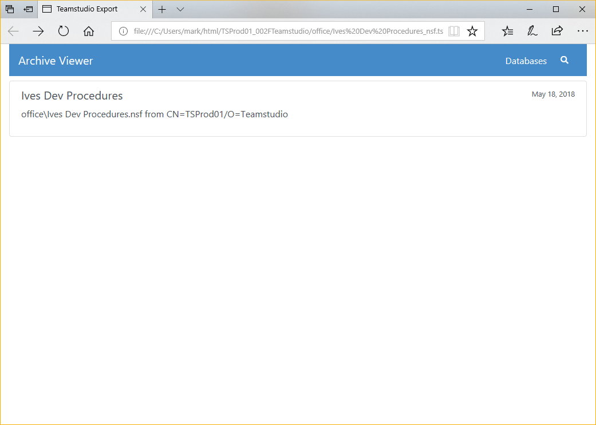
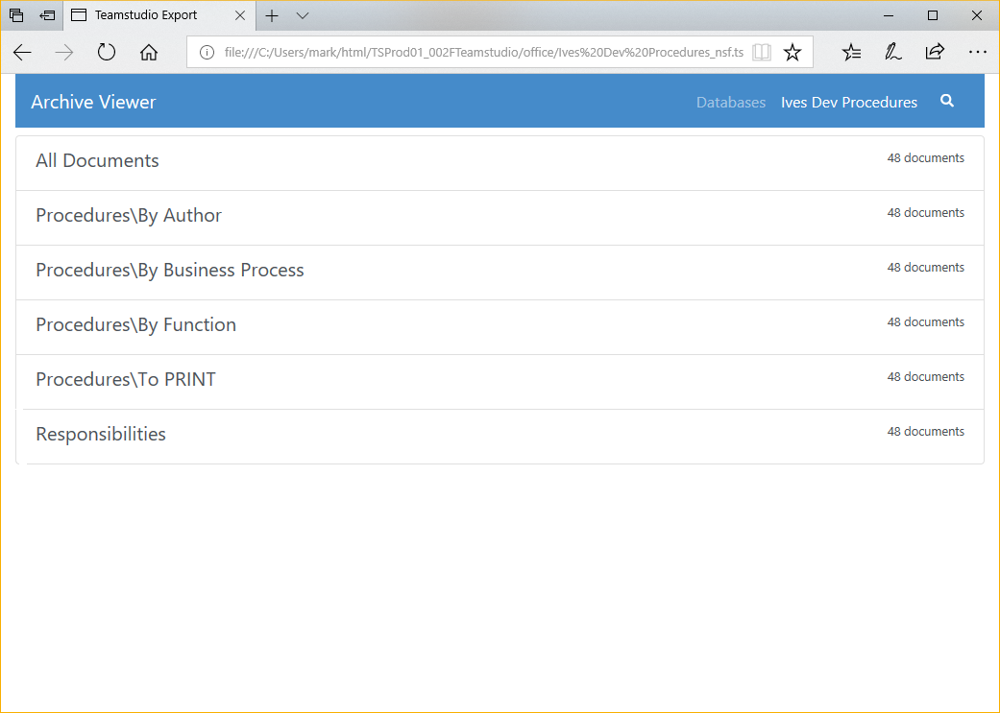

# PDFへのエクスポート

Teamstudio Export はアーカイブから静的な HTML/PDF サイトを生成することができます。このサイトには、データベース内のすべての文書を PDF に変換したものと、データベース内のカテゴリー別のようなビューすべてを HTML で表現した構成になっています。HTML ビューを使用して PDF をナビゲートしたり、お客様独自のコンテンツ管理システムに直接 PDF を保存して、そのシステムの上で検索機能を使用し文書を検索したりすることも可能です。

## 設定
PDFを出力する前に、設定ウィザードを実行して、(再)出力を書き出す*PDF Output Folder*を指定する必要があります。PDFのデフォルトのページサイズは*US Letter*ですが、詳細設定ページで*A4*または*A3*に変更することができ、また必要に応じてページの向きを*Portrait*から*Landscape*に変更することもできます。データベースに日本語のような非ヨーロッパ言語の文字が含まれている場合、デフォルトフォントの変更も検討する必要があります。詳細については、[設定](configuration.md)を参照してください。

## PDF の生成
アーカイブを PDF にエクスポートするには、メイン画面からエクスポートするデータベースを選択し、選択したデータベースの一つを右クリックし、コンテキストメニューから「PDF にエクスポート」を選択します。標準的な Windows の操作と同様に、*Ctrl キーを押しながら*クリックしてデータベースの範囲を選択し、 *Alt キーを押しながら*選択項目にデータベースを追加することもできます。追加する前に既存のアーカイブ操作が完了するのを待つ必要はありませんが、エクスポートは最大3つのタスクを一度に実行し、それ以外のタスクは既存のタスクが完了するまで待機状態になります。

[進行状況ウィンドウ](progress.md)から、進行中または待機状態にあるアーカイブのタスクの状況を確認することができます。エクスポート中に発生したエラーや警告を処理する方法については、上記のリンクページを参照してください。

!!! note
    PDF 出力は自己完結型の Web サイトであり、ランタイムの要件はありません。このサイトをコピーして
    フォルダをファイルシステム上の別の場所や Web サーバーにコピーし、最新のブラウザで表示することができます。
    Teamstudio Export ライセンスは、サイトの**生成**に関してのみ必要で、閲覧するだけの用途では継続的なライセンスは必要ありません。
    生成したサイトを配布し閲覧するためのコストは発生しません。

## データベースレベルの設定
Export 4.5.0 では、各データベースごとに @UserName、@UserRoles、@Environment で返される値をカスタマイズする機能が追加されました。新しい設定ダイアログにアクセスするには、データベースを右クリックし、コンテキストメニューから *Configure PDF...* を選択してください。ダイアログに入力された値は、PDF 出力の *config* フォルダに保存され、後で同じデータベースを再出力する場合にも再利用されます。

Export 4.5.1 では表示モードの設定をデータベースレベルで変更できるオプションを追加しています。*Use Defaults* BOXにチェックされている場合、Export の設定からのグローバル設定が採用されます。このチェックを外した場合、このデータベースだけに適用する *Display Mode* (表示モード)と *Expand all sections* (全セクションの展開) が設定可能となります。

## PDF サイトの表示
アーカイブを PDF にエクスポートしたら、メイン画面からデータベースを右クリックし、コンテキストメニューから*View PDF*を選択してサイトを表示させることができます。このプロセスによりデフォルトブラウザでサイトのホームページが表示されます。

<figure markdown="1">
  
</figure>

データベースをクリックすると、データベース内のビューのリストと、各ビューの文書数が表示されます。

<figure markdown="1">
   
</figure>

ビューをクリックすると、ビューに相当する画面が表示されます。元々ある Notes ビューの外観と完全に一致はしませんが、ほとんどが元のフォーマットと一致し、すべてのデータを含みます。

<figure markdown="1">
  
</figure>

ビューで文書をクリックすると、その文書の PDF がブラウザで開きます。

Teamstudio Export が文書のレンダリングに使用するフォームを見つけられない場合、一般的なアイテム名/値テーブルを含むドキュメントが作成されます。これには、リッチテキストを含む文書内のすべてのアイテムが含まれます。

## 文書リンク
データベース毎に文書リンクがサポートされています。対象となるデータベースが**アーカイブされている**限り、データベース間の文書リンクもサポートされています。もちろん対象となるデータベースは、文書リンクが正しく機能するために PDF にエクスポートする必要はありますが、対象となるデータベースのアーカイブが存在する限り、文書リンクは作成されます。

!!! note
 文書リンクを含むデータベースのグループがある場合、それらのいずれかを PDF にエクスポートする前に、**全ての**データベースをアーカイブする必要があります。このプロセスにより、全ての文書リンクが適切にエクスポートされます。

## 埋め込みビュー
Export 4.3.0 より埋め込みビューも PDF へ出力できるようになりました。埋め込みビューを出力するための要件があります:

* データベースにあるビューはアーカイブされていること。
* 埋め込みビューには *単一カテゴリの表示* のオプションがセットされていること。

埋め込みビューをエクスポートすると、エクスポート処理が少し遅くなります。現在の実装は、数十万エントリまでのビューに最適化されています。これよりはるかに大きなビューを使用していて、パフォーマンスの問題が発生した場合は、サポートに連絡してください。

Export 4.5.0　より前のバージョンでは、埋め込みビューは現在のデータベース内にある必要がありましたが、Export 4.5.0 より他のデータベースの埋め込みビューの参照をサポートするようになりました。ただし、文書リンクと同様、他のデータベースはアーカイブされている必要があり、ビューデータが Export で利用できる状態である必要があります。

## プリビュー表示の制限
Export の PDF 出力は Notes フォームを表示するのに必要なほとんどのプロパティを理解し動作します。しかしながらサポートされない主な機能は以下のとおりです

* フォームで使用されていたりフィールドから起動される LotusScript、JavaScript、エージェント
* @DbColumn。 ただし、Export 4.5.0　では @DbLookup と @GetDocField の両方をサポートしています
* アクション
* レイアウト領域
* 埋め込みのコントロール群 (埋め込みビューはサポート*しています*)
* パススルー HTML

Export はリッチテキストを PDF へ変換し、@関数言語のサブセットを処理し文書プリビューを生成します。プリビューには計算結果の値や非表示式の計算も可能な限り遵守しています。Export の新リリースでは頻繁に @関数 のサポートとレンダリングに関する改善を行っています。Export はアプリケーションのアーカイブからPDFを再生成することでこれらの改善を組み入れることができるようになっています。オリジナルの Notes アプリケーションにアクセスする必要はありません。実装されていない @関数およびレンダリングに関する問題がありましたら調査のために [techsupport_japan@teamstudio.com](mailto:techsupport_japan@teamstudio.com) までご連絡ください。

## 一般的な PDF に関する制限
Export はアーカイブしたアプリケーションを読み取り専用のデータの表示を簡単にできるようデザインされた HTML/PDF サイトを生成します。ビューと文書にのみフォーカスしており、ユーザーがこれまで慣れ親しんだやり方で文書を見つけアクセスできる方法を提供しつつ、Notes フォームに表示されるのと同等の内容を表示しています。しかしながら、 Export ではナビゲーター、アウトライン、フレームセット、ページ、エージェント、スクリプトライブラリーのような他の設計要素の代わりとなるいかなる HTML や PDF も生成しません。

## 全文検索
PDFにエクスポートされたデータベースは、全文検索が可能です。まず、検索したいビューを選択し、虫眼鏡をクリックすると検索ボックスが表示されます。*Enter*キーを押すと、検索が実行されます。ビューの中で、検索語の **全て** に一致するすべての文書が表示されます。文書は、文書内の一致件数と、一致した単語がデータベース内でどれだけ共通しているかによって決まる、一致の強さに基づいて並べ替えられます。例えば、データベース内に数回しか出現しない検索語にマッチした場合、*the*のような一般的な単語にマッチした場合よりも強いマッチングとなります。

全文索引には、テキストまたはリッチテキストフィールドで見つかった 2 文字以上のすべての単語が含まれます。検索は、単語の先頭にある検索語のみにマッチします。例えば、*at*を検索すると、*attach*にはマッチしますが、*cat*にはマッチしません。

Export では、最小 2 文字の制限のもとで、テキストだけでなく数字も索引が作成されます。索引の生成には、共通の単語境界が使用されることに注意してください。345678のような注文番号のような連続した数字のセットの検索はサポートされていますが、03/04/1999の検索は、それらが一緒に配置されているか日付値としてフォーマットされているかにかかわらず、03、04、1999で始まる個々のトークンを持つすべての文書と一致します。

検索の索引には添付ファイル内のテキストは含まれていません。

!!! note
    Export には 詳細設定の中で日本語のコンテンツに対する検索を調整するオプションがあります。日本語の表意文字用に調整したトークナイザーを使用して検索索引を作成します。この設定を有効にし、PDF に再出力すると検索索引が更新されます。