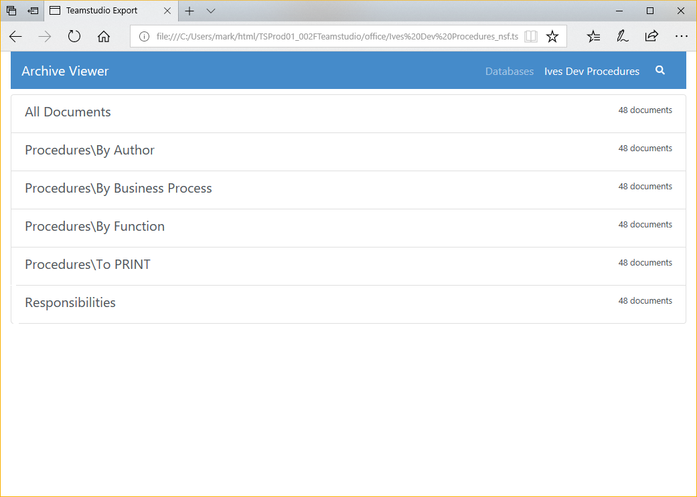

# Exporting to PDF

Teamstudio Export can generate a static HTML/PDF site from an archive. The site contains all of the documents in the database converted to PDFs, along with an HTML representation of all of the views in the database, including categorization. You can use the HTML views to navigate the PDFs, or store the PDFs directly in a content management system and use the searching features of that system to locate documents.

## Configuration
Before exporting PDFs, you will need to (re-)run the configuration wizard to specify the *PDF Output Folder* where the output will be written. The default page size for PDFs is *US Letter*, but you can change this to *A4* or *A3* on the advanced configuration page, and also change the page orientation from *Portrait* to *Landscape* as required. If your databases contain characters from non-European languages then you should also consider changing the default font. See [Configuration](configuration.md) for more details.

## Generating PDFs
To export archives to PDF, select the database or databases to be exported from the main window, right-click on one of the selected databases, and select *Export to PDF* from the context menu. As with standard Windows controls, you can use *Ctrl-Click* to select a range of databases and *Alt-Click* to add a database to the selection. You do not need to wait for all existing export operations to complete before adding more, but note that Export will run at most 3 tasks at once, and all other tasks will be queued until earlier operations have completed.

You can view the status of any active and queued tasks from the [Progress Window](progress.md). Please see that page for details of how to handle errors and warnings encountered during exporting.

!!! note
    The PDF output is a self-contained web site and has no runtime requirements. You can copy the site
    folder to another location on the file system or onto a web server and view it with any modern browser.
    While a Teamstudio Export license is required to **generate** the site, there are no ongoing licensing
    or runtime costs to distribute and view generated sites.

## Database-level Configuration
Export 4.5.0 adds the ability to tailor the values returned by @UserName, @UserRoles and @Environment for each database. To access the new configuration dialog, right-click on a database and select *Configure PDF...* from the context menu. The values entered into the dialog are saved into the *config* folder within the PDF output and will be re-used if you subsequently re-export the same database.

Export 4.5.1 adds additional database-level configuration options to modify display settings. If the *Use Defaults* box is checked, the global settings from the configuration wizard will be used. If you uncheck this box, you can configure the *Display Mode* and *Expand all sections* settings for this database only.

## Viewing a PDF Site
Once an archive has been exported to PDF, you can view the site by right-clicking on the database in the main window and selecting *View PDF* from the context menu. This will launch your default browser to the home page of the site.

<figure markdown="1">
  
</figure>

Clicking on the database will show a list of views in the database, along with a count of documents in each view.

<figure markdown="1">
   
</figure>

Clicking on a view will show a representation of the view. This does not attempt to fully match the look of the original Notes view, but does contain all of the data and matches most of the original format.

<figure markdown="1">
  
</figure>

Clicking on a document in the view will open the PDF for that document in your browser.

If Teamstudio Export is unable to locate a form to use to render the doucment, it will create a document containing a generic name/value table. This will include all of the items in the document, including rich text.

## Doclinks
Doclinks within a single database are supported. Doclinks between databases are also supported as long as the target database has been **archived**. Of course, the target database will also have to be exported to PDF for the doclink to function correctly, but the doclink will still be created as long as an archive exists for the target database.

!!! note
    If you have a group of databases that contain doclinks between themselves, you should archive **all**
    of the databases before exporting any of them to PDF. This ensures that all doclinks will be exported
    correctly.

## Embedded Views
Starting with Export 4.3.0, Embedded Views are exported to PDF. There are a few requirements for the view to be exported:

* The view must be in a database that has been archived.
* The embedded view must have the *Show Single Category* option set.

Exporting embedded views will slow down the export process a little. The current implementation has been optimized for views up to a few hundred thousand entries. If you have significantly larger views and encounter performance problems, please contact support.

Prior to Export 4.5.0, embedded views had to be in the current database. Export 4.5.0 added support for embedded views in other databases but, as with doclinks, the other database must have been archived so that the view data is available to Export.

## Preview Limitations
The Export PDF exporter understands most of the properties that are necessary to display a Notes form. The main features that are not supported are

* LotusScript, JavaScript, or Agents used by the form or invoked to populate fields
* @DbColumn. As of Export 4.5.0, both @DbLookup and @GetDocField are now supported
* Actions
* Layout Regions
* Embedded Controls (Embedded Views *are* supported)
* Passthru HTML

Export converts rich text to PDF and processes a subset of @Formula language to generate documents that include computed values and respect hide-when calculations, where possible. New releases of Export often enhance @Formula support and improve rendering. Export can regenerate the PDFs from the application archive to incorporate improvements - without requiring access to the original Notes application. Missing @Formula functions, and other rendering issues, can be reported to [techsupport@teamstudio.com](mailto:techsupport@teamstudio.com) for evaluation.

## General PDF Limitations
Export generates an HTML/PDF site designed to make it easy to view the read-only data in archived applications. Views and documents are the focus of this functionality, providing familiar ways to find and access documents, and view documents as they would appear in the Notes form. Export does not generate any HTML or PDF representation of other design elements such as navigators, outlines, framesets, pages, agents, or script libraries.

## Full-Text Search
Databases exported to PDF are full-text searchable. To start, select the view that you want to search and click the magnifying glass to show the search box. The search will be performed when you hit the *Enter* key. All documents in the view that match **all** of the search terms will be displayed. The documents are sorted based on the strength of the match, which is determined by how many matches are in the document, and how common the matched words are in the database. For example, matching a search term that only appears a few times in the database is a stronger match than matching a common word like *the*.

The full-text index contains all words of 2 or more characters found in text or rich text fields. Searches only match search terms found at the beginning of words. For example, searching for *at* would match *attach* but would not match *cat*.

Export will index numbers as well as text, subject to the 2 minimum character limit. Note that common word boundaries are used to generate the index. Searches for contiguous sets of numbers are supported, such as order numbers like 345678; however, searches for 03/04/1999 will match any document with individual tokens beginning with 03, 04, and 1999, regardless of whether they are located together or formatted as a date value.

The search index does not contain text within attachments.

!!! note
    Export has an advanced configuration option to optimize searches for Japanese content by creating the
    search index using a tokenizer tuned for Japanese ideograms. Once this setting is enabled, re-exporting
    to PDF will update the search index.