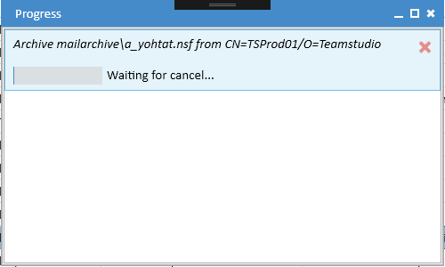
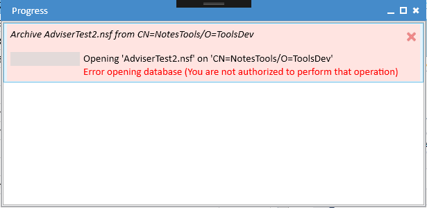
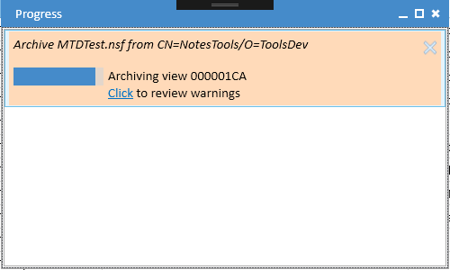

# Progress Window

The Progress window displays the status of all tasks that are currently active. To view the Progress window, choose *Window|Progress* from the main menu. If there are active tasks, you can also click on the activity indicator in the status bar at the bottom of the main window. Tasks will automatically be removed from the window as they complete successfully. Tasks with errors and warnings will remain in the window so that you are able to review any problems that occurred.

## Canceling a Task
To cancel a task, move your mouse over the task and a cancel button (X) will display:

Clicking the close button will cancel the task. The progress message will change to *Waiting for cancel...*. Note that it may take a few moments for the task to complete and be removed from the window.

## Errors
If an error occurs during a task, the task will not complete and it will display in the progress window with a red background.

You can use the same cancel button to clear the task from the list.

## Warnings
Some tasks may complete but encounter some problems that require your attention. The most common cause of this is when archiving is not able to export all documents because of reader fields or crashes in the Notes DXL Exporter. When this occurs, the task will be displayed with a pale orange background.

You can click where indicated to view the warnings.

You can choose to either cancel the task and discard the archive or keep the archive if the warnings are not serious enough to justify discarding it. You may also be able fix the problems that are causing the warnings and then repeat the archive.

### Common Warnings
#### You are not authorized to perform that operation
This can be fixed by either removing readers fields from the affected documents or, if you have the necessary rights on the server, enabling Full Access Admin in the Export configuration. 
#### Incomplete run detected for note id XXXXXXXX
This indicates that the Notes DXL exporter crashed on the given document. These crashes can sometimes be fixed by opening the relevant document in the Notes client (or Designer if it is a design note) and making a minor change such as adding a space.