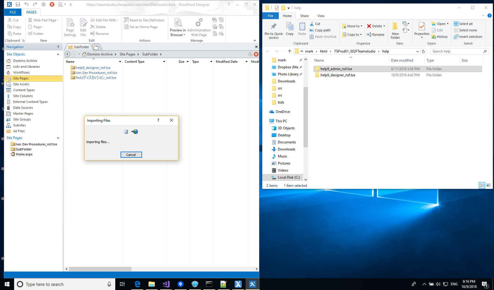

# Microsoft SharePointにHTMLサイトを保存

Export 2.1から、HTMLにエクスポートされたアプリケーションは自動的にMicrosoft SharePointとの互換性があります。エクスポートによって生成されるサイトは自分を含むフォルダとなり、必要な作業はSharePointのサイト内にあるサイトページライブラリにフォルダ全体をインポートするだけです。現在、SharePointのウェブインターフェイス上ではこのプロセスを実行できない為、Microsoft SharePoint Designerの使用が必要になることにご注意ください。

Teamstudio ExportでHTMLにアプリケーションをエクスポートした後、次の手順に従うことでSharePointにインポートすることができます。

1. Microsoft SharePoint Designerが環境下にない場合は、ダウンロードしてインストールしてください。Microsoftによる無料ダウンロードが可能です。最新版は[こちら](https://www.microsoft.com/en-us/download/details.aspx?id=35491)です
2. SharePoint Designerを起動し、エクスポートされたアプリケーションをホストにしたいSharePointサイトで開きます。
3. アプリケーションをSharePoint内のサイトページライブラリにインポートします。複数のアプリケーションをインポートし、後にディレクトリ構造として保存したい場合は、[新規メニューの新しいフォルダコマンドを表示する]を有効にすることで、フォルダの作成を可能にする必要があります。またこのプロセスを実行する際は、SharePoint Designerにある[サイトオブジェクト]のリストから[リストとライブラリ]を選択し、[サイトページ]の文書ライブラリを選択した後、[詳細設定]の部分からオプションをチェックします。
   
4. [サイトオブジェクト]のリストから[サイトページ]を選択します。その後、コンテンツを含むリストを右クリックし、[新規]メニューを使用することで、必要なフォルダを作成します。
   

     
Note

    Teamstudio Exportからエクスポートされた各アプリケーションは完全な自分自身を含むフォルダとなっており、お使いのPCのファイルシステム、又はSharePoint内に任意に保存することができます。唯一考えられる例外は、アプリケーション間に文書リンクがある場合です。これらのリンクは、アプリケーション間で同じ相対パスを保持する場合のみ正常に動作します。従って、それらのアプリケーションが両方ともドミノサーバー上の同じフォルダに存在する場合は、SharePoint内においても同じフォルダに存在する必要があります。同様に、サーバー上に兄弟関係のフォルダがある場合は、SharePoint内においても同じ名前の兄弟兄弟関係のフォルダが存在する必要があります。Exportが作成するHTML出力フォルダと同じフォルダ構造を再度SharePoint内に作成した場合、全て正常に動作します。
     

   

5. 残っている作業として、エクスポートされたアプリケーションをSharePointにドラッグします。エクスポートされたアプリケーションのコレクション全体をインポートする場合は、ルートHTMLフォルダを[サイトページ]にドラッグします。また、個々のアプリケーションをドラッグしたい場合は、適切なフォルダ(.tse拡張子)を選択し、SharePoint Designer内にある適切なフォルダにドラッグします。
   
   インポートが完了しても、SharePoint DesignerのUIが自動的に更新されないことがあります。その場合は、SharePoint Designerウィンドウの右側になる緑色のボタンをクリックすることで、更新を行うことができます。
6. サイトをインポートした後に、ブラウザからアクセスするにはサイトから[サイトページ]を選択し、必要に応じて適切なフォルダに移動してから、*[indexsp.aspx]*ページをクリックします。SharePointのサイトに1つだけエクスポートされたアプリケーションが含まれている場合は、SharePoint Designerで*[indexsp.aspx]*ファイルを右クリックし、メニューから[ホームページに設定]を選択することで、サイトに訪れた際の表示を自動的に行うことができます。SharePointのサイトに複数のエクスポートされたアプリケーションが含まれている場合は、エクスポートされたアプリケーションのために*SharePointが[indexsp.aspx]*ファイルへリンクを含むように作成したデフォルトの*[Home.aspx]*ページを変更することも可能です。