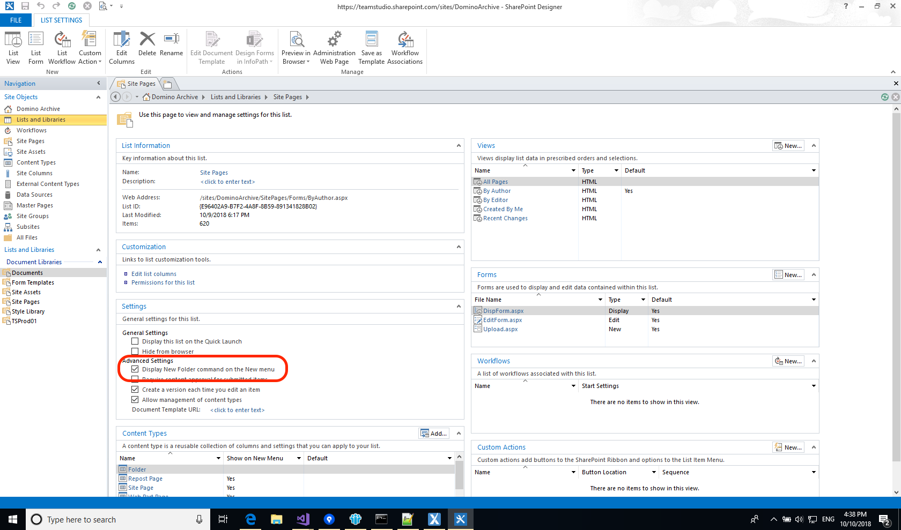

# Storing HTML Sites in Microsoft SharePoint

Starting with Export 2.1, applications that have been exported to HTML are automatically compatible with Microsoft SharePoint. The sites that Export generates are self-contained folders and all that is necessary is to import the entire folder into the Site Pages library in your SharePoint site. Note that you cannot currently do this with the SharePoint web interface, you will need to use Microsoft SharePoint Designer.

Once you have exported your applications to HTML in Teamstudio Export, follow these steps to import them into SharePoint.

1. If you do not already have it, download and install Microsoft SharePoint Designer. This is a free download from Microsoft: the current version is available [here](https://www.microsoft.com/en-us/download/details.aspx?id=35491).
2. Launch SharePoint Designer and open the SharePoint site where you want to host the exported applications.
3. You will import the applications into the *Site Pages* library in SharePoint. If you will be importing multiple applications and want to store them in a directory structure then you will need to enable the *Display New Folder command on the New menu* setting to allow you to create folders. To do this, select *Lists and Libraries* from the *Site Objects* list in SharePoint Designer, choose the *Site Pages* Document Library and check the option in the *Advanced Settings* section.
   
4. Now select *Site Pages* from the *Site Objects* list. Create any folders that you need by right-clicking in the list of contents and using the *New* menu.
   

     
Note

    Each application exported from Teamstudio Export is a completely self-contained folder and you can
    store the folder anywhere you like on your file system or in SharePoint. The only exception to this is
    when you have doclinks between applications. Those links will only work correctly if you retain the
    same relative path between the applications. So if they were both in the same folder on your Domino
    server then they must be in the same folder in SharePoint. Similarly, if they were in sibling
    folders on the server then they must be in sibling folders with the same names in SharePoint.
    If you recreate the same folder structure in SharePoint that Export created in the HTML output
    folder then everything will work correctly.
     

   

5. All that remains is to drag the exported applications into SharePoint. If you are importing your entire collection of exported applications then you can just drag the root HTML folder into *Site Pages*. More likely, you will want to drag individual applications. To do this, select the appropriate folder (it will have a *.tse* extension) and drag it to appropriate folder in SharePoint Designer.
   
   You may find that the SharePoint Designer UI does not update automatically when the import is complete. If that happens, click the green refresh button in the top-right of the SharePoint Designer window to force a refresh.
6. Once your site is imported, you can access it from a browser by choosing *Site Pages* from the site, navigating to the appropriate folder if necessary and then clicking the *indexsp.aspx* page. If your SharePoint site contains a single exported application  then you can make this display automatically when you enter the site by right-clicking on the *indexsp.aspx* file in SharePoint Designer and choosing *Set as Home Page* from the menu. If your SharePoint site contains multiple exported applications then you may want to modify the default *Home.aspx* page that SharePoint creates to contain links to the *indexsp.aspx* files for your exported applications.