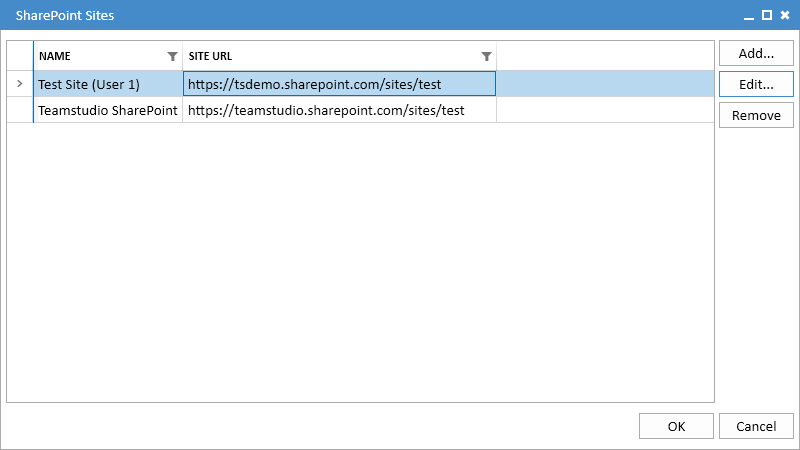
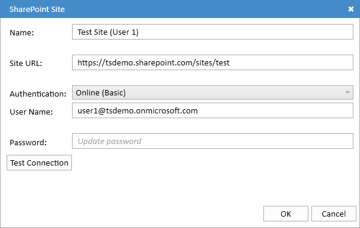
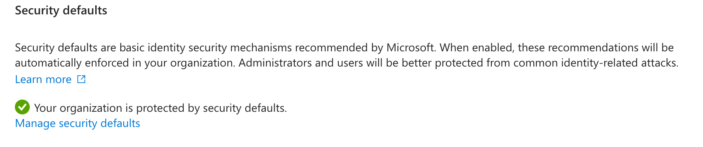
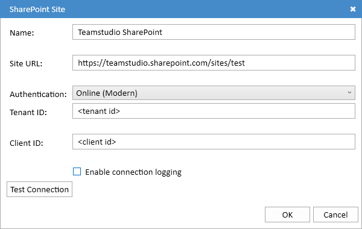

# Configuring SharePoint

Clicking the *Sites...* button will display the SharePoint Sites dialog, allowing you to manage your SharePoint site configurations. 

<figure markdown="1">
  
</figure>

Each site configuration defines the location (URL) of a SharePoint site, along with the authentication method and, if necessary, credentials needed to access it.

## Configuring a Site
You can use the *Add...* and *Edit...* buttons to create a new site or edit an existing one. Choosing either option will display the SharePoint Site dialog.

<figure markdown="1">
  
</figure>

This dialog will look slightly different depending on the authentication method selected.

## Common Settings
* **Name** A name used to refer to the site. This can be any text you choose, and is only used to identify the site in the Export UI.
* **Site URL** The full URL of the SharePoint site.
* **Authentication** The authentication method. Export currently supports two methods:
    * **Online (Basic)** SharePoint Online with basic username/password authentication.
    * **Online (Modern)** SharePoint Online using modern OAuth authentication.

## Online (Basic) Authentication
This authentication method is used with SharePoint Online if your organization still allows basic username/password authentication. Note that this method is disabled by default in SharePoint Online and would have to have been explicitly re-enabled by your admin team. An admin can verify whether it is available by logging into [Microsoft Entra](https://entra.microsoft.com), selecting *Overview* and then *Properties*. At the bottom of the screen, you will see the *Security Defaults* setting. If this says

<figure markdown="1">
  
</figure>

then you are using modern authentication and will not be able to log in with a username and password.

If username and password authentication is available to you, then choose *Online (Basic)* as the authenticaion method. Your dialog will look like this:

<figure markdown="1">
  
</figure>

Enter your usernmae and password into the appropriate fields. You can use the *Test Connection* button to verify that everything is working correctly. Your password will be encrypted using the Microsoft Data Protection APIs (DPAPI) and will not be readable by any other user logging onto the computer.

## Online (Modern) Authentication
This authentication method for SharePoint Online requires more configuration but offers significantly enhanced security. In particular, your admin will need to register Export as an allowed application. This is a fairly simple process, but it must be performed by a user with the necessary rights to access Entra.

If you select *Online (Modern)* authentication, your dialog will look like this:

<figure markdown="1">
  
</figure>

You will need a *Tenant ID* and *Client ID* from your SharePoint admin team. The steps for an admin to perform are listed below. Note that these steps only need to be performed once for all users in your organization.

Once you have your Tenant ID and Client ID, you can use the *Test Connection* button to verify that everything is set up correctly. The first time you use it, you will be prompted to log in with your username and password. This will generate an access token that will saved on your computer so that you do not need to log in again. The access token is saved in a file named *MSALCache* in your local application data folder, usually AppData\Local\Teamstudio in your home folder. As with passwords, this file is encrypted using DPAPI and is not readable by any other user logging onto the computer.

If you have problems connecting, you can enable detailed connection logging by checking the *Enable Connection Logging* box. This will write a detailed connection log to a log file in your local application data folder. The log will not include any personally identifiable information. 

## Registering Teamstudio Export in Entra
These are instructions for your SharePoint Online administrator. They can configure SharePoint Online to allow application access and give you the necessary values you need to configure Export.

Export must be registered as an application in Microsoft Entra with the necessary permissions to write and create lists. This is performed from [Microsoft Entra](https://entra.microsoft.com).

1. Expand the *Applications* category and choose *App Registrations*.
2. Choose *New Registration*.
3. Enter *Teamstudio Export* as the name.
4. Under *Supported Account Types*, choose *Accounts in this organizational directory only*.
5. Under *Redirect URI (Optional)*, choose *Public client/native* from the dropdown and enter *http://localhost* as the URI. Note that this must be http, not https. Also, this step is not optional!
6. Click the *Register* button to create the application.
7. Export will be creating lists in SharePoint, so it needs to be given the necessary permissions. To do this, select *API permissions* under *Manage*.
8. Click *Add a permission*. Select *SharePoint* from the list of applications, and then *Delegated permissions*. Check the *AllSites.Manage* permission, and then click the *Add permissions* button.

That will register the application with the necessary settings. From the application overvew, you can copy the *Application (client) ID* value and the *Directory (tenant) ID*. These are the values that your users will need to configure Export.